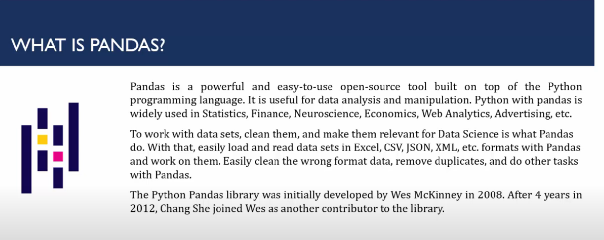
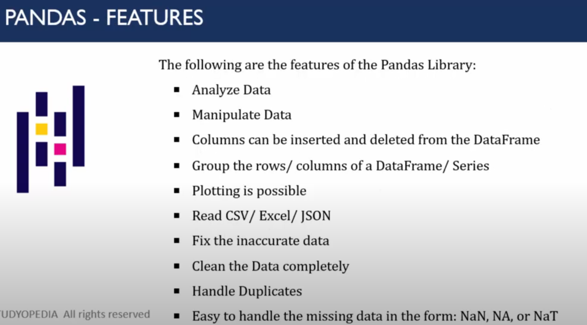

What is Pandas

Here's the content from the YouTube video summarized in bullet points:

- **Video Source:** Amit Thinks (YouTube)
- **Topic:** Comprehensive overview of **Python Pandas** library.
- **Overview of Pandas:**
  - Built on Python.
  - Powerful and user-friendly data analysis and manipulation library.
  - Widely used across multiple domains:
    - Statistics
    - Web analytics
    - Neuroscience
    - Finance
    - Machine learning

- **Key Functionalities:**
  - Can load and read various dataset formats:
    - Excel
    - CSV
    - JSON
  - Tools for handling:
    - Duplicate data
    - Missing or incomplete data
    - Ensuring clean datasets for accurate insights

- **Core Data Structures:**
  - **DataFrames:**
    - Two-dimensional tabular structures (like spreadsheets or SQL tables).
    - Used for inserting, deleting, and grouping rows/columns.
    - Ideal for structured data manipulation.
  - **Series:**
    - One-dimensional labeled array.
    - Similar to a single column in a spreadsheet.
    - Supports vectorized operations.

- **Use Cases Highlighted:**
  - Data cleaning
  - Data transformation
  - Data exploration
  - Preparing data for visualization or modeling

Let me know if you'd like a visual diagram or further breakdown!