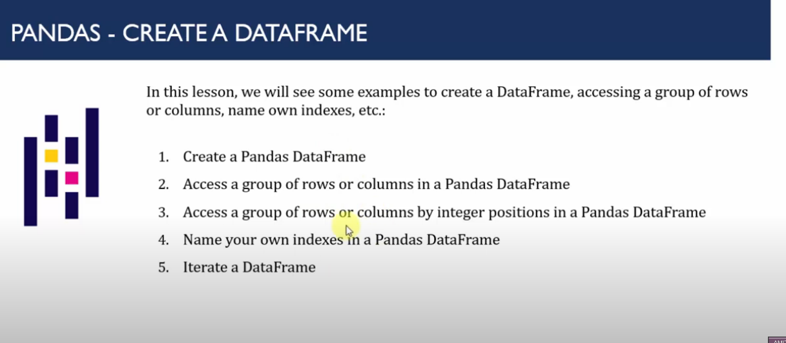

Here is the extracted text from the image:

---

### **What is a Pandas DataFrame? How to Create?**

The Pandas DataFrame is a two-dimensional, tabular data structure with rows and columns. The `DataFrame()` method is used to create a DataFrame and has the following parameters:

- **data**: The data to be stored in the Pandas DataFrame.
- **index**: The index values to be provided for the resultant frame.
- **columns**: Set the column labels for the resultant frame if the data does not mention them beforehand.
- **dtype**: It specifies the data type, and only a single type is allowed.
- **copy**: To copy the input data.

---

Let me know if you need further assistance!

Here is the extracted text from the image:

---

### **Pandas - Create a DataFrame**

In this lesson, we will see some examples to create a DataFrame, accessing a group of rows or columns, naming your own indexes, etc.:

1. Create a Pandas DataFrame  
2. Access a group of rows or columns in a Pandas DataFrame  
3. Access a group of rows or columns by integer positions in a Pandas DataFrame  
4. Name your own indexes in a Pandas DataFrame  
5. Iterate a DataFrame  

--- 

