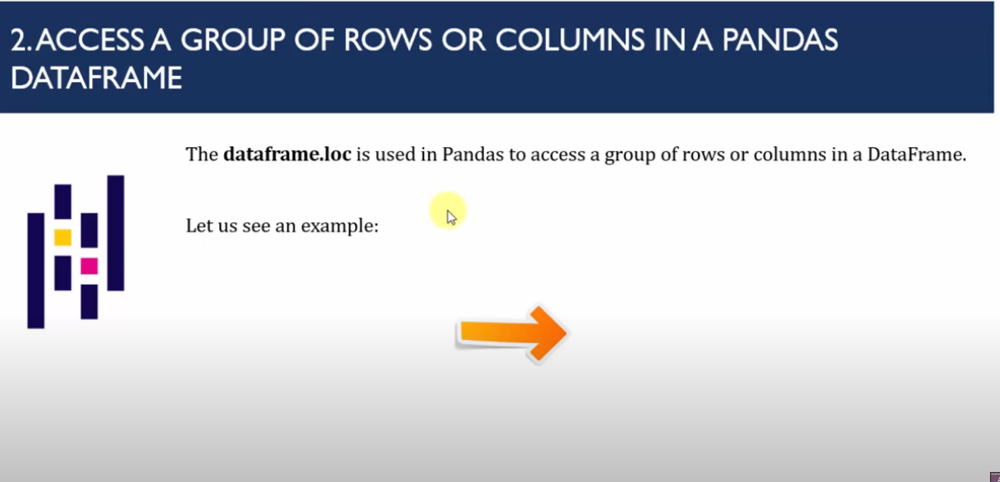

profile
Qwen3-235B-A22B
5:58 pm
Here is the extracted text from the image:

2. Access a Group of Rows or Columns in a Pandas DataFrame
The dataframe.loc is used in Pandas to access a group of rows or columns in a DataFrame.

Let us see an example: